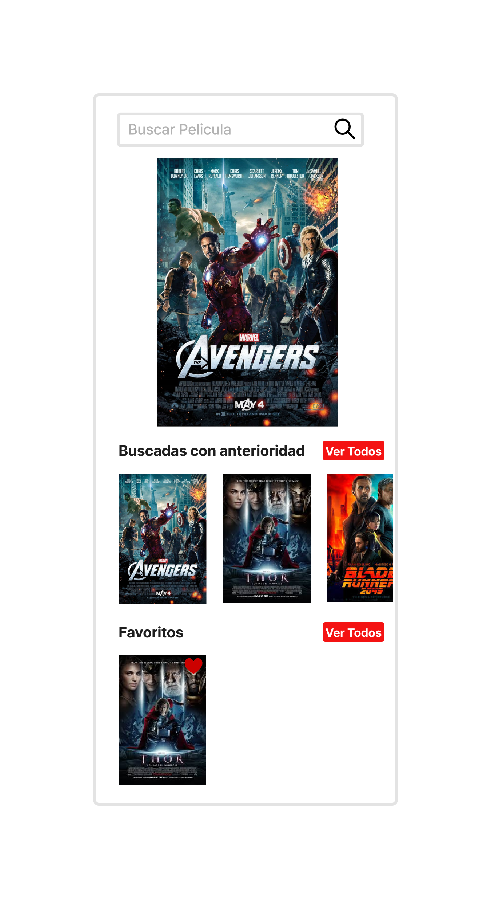
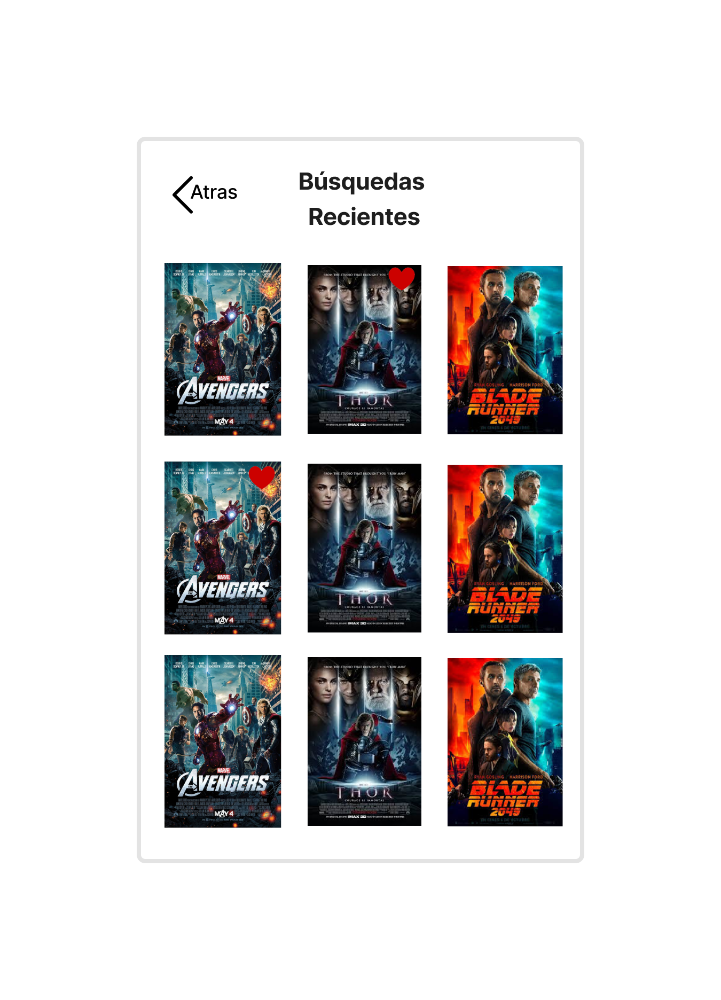
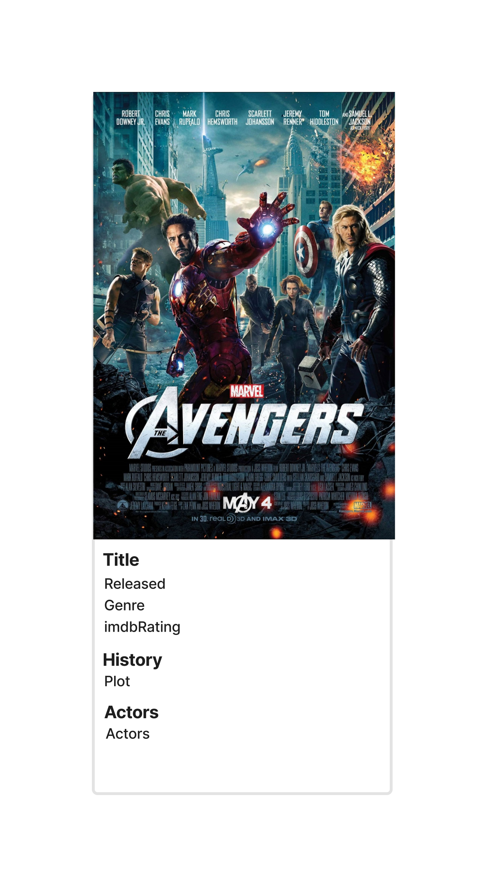

# TareaReactNative
Prueba Técnica de React Native - API OMDB

Se debe realizar una aplicación móvil utilizando React Native en su última versión que muestre
información sobre películas utilizando la API pública de OMDB (https://www.omdbapi.com/).

## Requisitos

Esta tarea utiliza:

- React Native 0.73.3
- Redux 5.0.1

## Competencias:

● La aplicación debe tener al menos tres pantallas: una pantalla de búsqueda, una de detalles
de la película y favoritos.

● Al realizar una búsqueda, la aplicación debe llamar a la API de OMDB para obtener los
resultados correspondientes al título ingresado.

● Los resultados deben mostrarse en una lista, donde cada elemento debe mostrar información
relevante.

● Al hacer clic en un elemento, la aplicación debe mostrar la pantalla de detalles de la película
correspondiente.

● Debes utilizar la API de OMDB para obtener los detalles adicionales de una película cuando
se selecciona de la lista de resultados de búsqueda.

● Se deben poder agregar películas a una lista de favoritos y revisar su información.

● Diseño y UX no serán evaluados específicamente, sin embargo debe entenderse la
información desplegada.

● Cualquier otra funcionalidad no mencionada se considera en la evaluación, pero no es
obligatoria.

● Cualquier cosa no especificada queda a criterio del desarrollador.

| Característica                   | Ubicación del proyecto de la muestra      |
| -------------------------------- | ----------------------------------------- |
| 🕹 Configuración del SDK *Purchases*  | [App.js](App.js#L17) |
| 🔍 Construyendo la búsqueda        | [src/screens/SearchScreen/index.js](src/screens/SearchScreen/index.js) |
|                                   | |
| ❤️ Sección Favoritos           | [src/screens/FavoritesScreen/index.js](src/screens/FavoritesScreen/index.js) |
|                                   | |
| 🎞️ Detalles de la película           | [src/screen/DetailsScreen/index.js](src/screen/DetailsScreen/index.js) |
|                                   | |

## Configurar y ejecutar

### Requisitos previos
- Asegurese de configurar correctamente las variables de entorno con Java Development Kit 17
- Asegurese de obtener su [API key](https://www.omdbapi.com/apikey.aspx)

### Pasos para ejecutar
1. Descarga o clona este repositorio
    > git clone https://github.com/Fayalap/TareaReactNative.git

2. Asegúrese de tener [administrador de paquetes de node (npm)](https://docs.npmjs.com/downloading-and-installing-node-js-and-npm) instalado en su máquina.

3. Navegue al directorio `TareaReactNative` e instale las dependencias usando npm

    ```
    cd TareaReactNative
    npm install
    ```

4. Ejecute la aplicación en un simulador o dispositivo físico.

```
npm run android
```


## Soporte

Para obtener más detalles técnicos, consulte hacia mi correo electronico francoyala.77@gmail.com
o por llamada al +56988575861.

## Creditos

Esta prueba tecnica de react native fue construida por Franco Ayala para NiuFoods.
